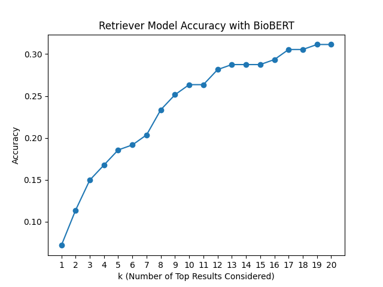
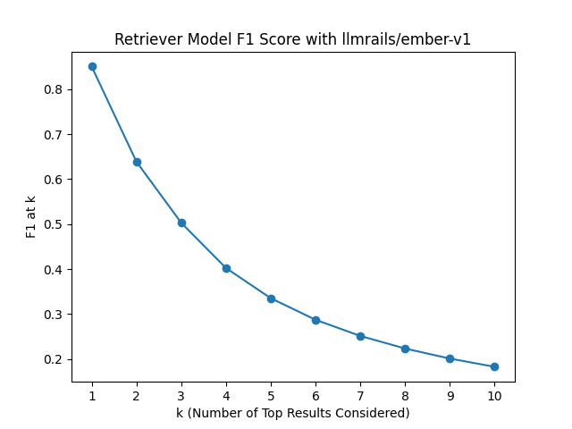
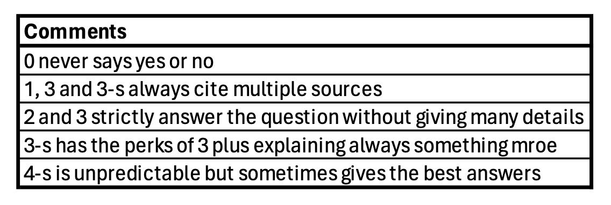

# 👾 RAGMedAssist

### 🧑🏻‍🎓 Team Members

| Name and surname    | Matric. Nr. | Course of study                           |   e-mail address   |
|:--------------------|:------------|:------------------------------------------|:-------------------|
| Matteo Malvestiti | 4731243     | M.Sc. Data and Computer Science (Erasmus) | matteo.malvestiti@stud.uni-heidelberg.de|
| Sandra Friebolin | 3175035     | B.Sc. Computational Linguistics           | sandra_friebolin@proton.me |
| Yusuf Berber | 4736316     | M.Sc. Data and Computer Science           | yusuf.berber@stud.uni-heidelberg.de |


### Advisor

Robin Khanna (R.Khanna@stud.uni-heidelberg.de)

***

## Table of contents

1. ➡️ [Introduction](#introduction)
2. 📚 [Related Work](#related-work)
3. ⚙️ [Approach](#approach)
    - ✂️ 3.1 [Data Processing](#data-processing)
    - 👾 3.2 [Algorithms & Methods](#algorithms-methods)
    - 3.3 [Baselines](#baselines)
    - 3.4 [Fine-Tuning](#fine-tuning)
4. 🔬 [Experimental Setup & Results](#experimental-setup-results)
    - 💽 4.1 [Data](#data)
    - 📥 4.2 [Vector Database](#vector-database)
    - 📈 4.3 [Evaluation](#evaluation)
        - a) [Evaluation of Information Retrieval](#retrieval-eval)
        - b) [Evaluation of Chatmodel](#chatmodel-eval)
    - 🧐 4.4 [Analysis](#analysis)
5. ⚡️ [Limitations & Future Work](#limitations-future-work) 🔮
6. 💡[Conclusion](#conclusion)
7. 💻 [References](#references)
8. 📊 [Appendix](#appendix)
    - 🧑🏻‍🎓 [Contributions](#contributions)
    - 📝 [Anti-Plagiarism Declaration](#anti-plagiarism)

***

# <a name="introduction"></a>1. ➡️ Introduction

Our chatbot is specifically designed for biomedical professionals seeking to navigate the vast and complex field of medical research and literature. It serves as an advanced tool for acquiring insights into specific studies, understanding the latest research on various topics, or evaluating the effectiveness of certain methods. Recognizing the value of source verification in the scientific community, our chatbot provides clickable links to the papers whose abstracts were used for answer generation. This feature enables users to delve deeper into their research, ensuring they have access to and can trust the foundational material.

Tailored to meet the needs of doctors, researchers, and other medical field experts, our chatbot simplifies the complex domain of medical knowledge into manageable, accessible information. Users can pose questions in everyday language and receive concise, clear answers that are directly sourced from a comprehensive database of medical literature, including over 60,000 PubMed article abstracts.

By integrating generative artificial intelligence (AI) with advanced Retrieval Augmented Generation (RAG) techniques, our chatbot exceeds the limitations of conventional keyword searches. It employs a sophisticated hybrid search algorithm that combines semantic retrieval — leveraging dense vector search for detecting relevance through cosine similarity — with precise keyword search to identify domain-specific terms. This dual approach ensures that our biomedical professional users are equipped with the most relevant, up-to-date, and accurate medical information available, facilitating informed decision-making and further research exploration.

<span style="color:red"> **MISSING: outlook on results**</span>


# <a name="related-work"></a>2. 📚 Related Work
<!--
- put our work into context of current research
- including papers read for research/that used same techniques but applied to different problems
- emphasize how our work differs from previous work, outlining their limitations/why our application domain is different
- ⚠️ only major points, not too much detail
-->
Our chatbot application follows the RAG approach that combines pre-trained parametric and non-parametric memory for language generation tasks, thus allowing the model to access explicit knowledge sources and enabling them to generate enhanced, factual content ([Lewis et al., 2021](#RAG)). Having an effective retrieval system is crucial, as it determines the quality and relevance of the generated answer to the query. An influential work examining the efficacy of embedding models for retrieval tasks is "MTEB: Massive Text Embedding Benchmark" by [Muenninghoff et al., 2023](#MTEB). This paper presents an extensive framework for the evaluation of embedding models and addresses their limitations. It served as a key resource for us to survey available models, with a particular focus on those tailored for retrieval and semantic textual similarity tasks. The paper is directly connected to the [Hugging Face Massive Text Embedding Benchmark (MTEB) Leaderboard](https://huggingface.co/spaces/mteb/leaderboard). This platform enables researchers to benchmark text embeddings, comparing their effectiveness across an array of tasks and datasets, thus facilitating a deeper understanding of model capabilities and performance nuances. We used it as a foundational guide in selecting the most suitable embedding model for our needs.

A platform similar to our own is [Perplexity.ai](https://www.perplexity.ai/), a search engine leveraging NLP and machine learning to deliver precise and detailed responses to user inquiries. Notably, it supports attaching files to queries, enabling QA based on the content of those files. This feature mirrors an aspect of our system's capabilities, particularly in generating answers from provided information. Another similarity is the provision of sources: Perplexity.ai, much like our application, presents its sources through clickable links. However, a notable distinction emerges upon closer examination, as illustrated in the screenshot below. Often, Perplexity.ai's sources span a broad spectrum, including non-scientific references, whereas our chatbot exclusively utilizes scientific sources. This deliberate choice ensures our platform is finely tuned to meet the needs of medical professionals who depend on trustworthy information for their research and decision-making processes.
<p align="left">
  
</p>

- <span style="color:red"> **Elaborate**</span> A feature that we implemented and we will discuss in [sec. 3.2](#iii-document-retrieval) is Ensemble Retrieval. More specifically, we retrieved documents both with a sparse retriever and a dense retriever and reranked them with Reciprocal Rank Fusion. Inspiration and guideline for this procedure was [Cormack et al., 2009](#RRF)

# <a name="approach"></a>3. ⚙️ Approach
<!--
- conceptual details of our system (about its functionality, its components, data processing pipelines, algorithms, key methods)
- 💡 be specific about methods (include equations, show figures...)
- 💡 emphasize creative/novel parts, but also properly cite existing methods
- 💡 stick to fixed vocabulary (mathematical notations, method & dataset names) and writing style!
- describe baseline approaches (briefly if from external source)
-->

## <a name="data-processing"></a>3.1 ✂️ Data Processing

Several data cleaning and pre-processing strategies were considered and applied according to their usefulness to our specific application (see [`preprocess_data.py`](data/preprocessing_and_analytics/preprocess_data.ipynb)):

✅ **Removing Special Characters:** This includes stripping out unnecessary punctuation, symbols, or special characters that are not relevant to the analysis or could interfere with the model's understanding of the text. We apply this step to to enhance data consistency and reduce noise, thereby improving model focus and efficiency.

✅ **Normalization:** This process standardizes text to a consistent format, enhancing data uniformity and simplifying processing. Specifically, we implemented Unicode normalization to transform author names with special characters — common in languages such as Swedish and French — into a uniform representation. 

✅ **Tokenization:** Essential to the embedding process, tokenization divides text into manageable pieces, or tokens. Our chosen embedding models employ unique tokenizers that segment text into words and subwords. This granularity enables precise interpretation of biomedical terminology, accommodating the field's extensive vocabulary and specialized jargon.

✅ **Removing Short Abstracts:** Abstracts with fewer than 100 characters often lack sufficient detail, offering minimal insight. To enhance our dataset's quality, we excluded such brief abstracts and those lacking any abstract text. This refinement process resulted in the retention of 58,535 abstracts, effectively removing 319 from our initial collection.

❌ **Lowercasing:** Converting all text to lowercase can be beneficial for consistency and improve performance for many embedding models. However, in certain scientific contexts, such as our biomedical texts, case sensitivity is important, for instance when distinguishing between gene names and common words. We thus decided against lowercasing, also given that we used very advanced embedding models able to handle case sensitivity.

❌ **Handling Stop Words:** Removing common words that do not contribute much meaning to the sentences was a common practice for traditional approaches as it gives more focus on important content words. However, advanced embedding models, especially those based on Transformer architecture, are designed to capture the context of the entire sentence or document, including the function of stop words. In fact, [Miyajiwala et al.](#stopwords) (2022) have shown that the removal can even lead to a drop in performance. We thus decided against removing them.

❌ **Handling Bigrams or N-grams:** Advanced Transformer based models do not require this step since they are designed to capture word context using their attention mechanisms and positional embeddings, making explicit n-gram creation less necessary.

## <a name="algorithms-methods"></a>3.2 👾 Algorithms & Methods

Our ultimate goal is to create a chatbot capable of answering questions on topics within the biomedical domain and a specific focus on intelligence-related matters. To achieve this, we have developed a Retrieval-Augmented-Generation (RAG) system that consists of two main components: a retrieval system and a generative large language model (LLM). The retrieval system is responsible for retrieving the most relevant documents for a given user query. Its effectiveness and accuracy is guaranteed thanks to our adoption of the [FAISS](https://ai.meta.com/tools/faiss/) vector database for storing our document embeddings. A central part of our chatbot's ability to generate contextually relevant questions is the chosen LLM, which leverages context provided by the retrieved documents to produce not only accurate responses but also tailored to the specific nuances of the users' query. The versatile [LangChain](https://python.langchain.com/docs/get_started/introduction) framework we use facilitates the seamless integration of these two components. It allows us to dynamically integrate context and reasoning capabilities into our application, thereby enabling the development of an advanced, interactive AI system.

In the subsequent sections, we will delve into the specifics of the algorithms and techniques we have employed within our system.

#### I. Embedding Documents

The initial phase of developing our system entailed selecting an appropriate embedding model to generate document embeddings, a critical component for ensuring the accuracy of document retrieval and, by extension, the quality of the responses generated by our system. To this end, we referred to the [Massive Text Embedding Benchmark (MTEB) Leaderboard](https://huggingface.co/spaces/mteb/leaderboard) for retrieval tasks. Our selection criteria prioritized models that were both high-performing according to the leaderboard and feasible in terms of availability and size. Please note that this leaderboard is continuously updated with new models, so our chosen one might not keep its top place currently. After a thorough examination of various models, detailed in section 4.3 a) [Evaluation of Information Retrieval](#retrieval-eval), we chose the [General Text Embedding (GTE)](https://huggingface.co/thenlper/gte-large) model, which easily accessible via Hugging Face's platform:

```py
from sentence_transformers import SentenceTransformer

model = SentenceTransformer("thenlper/gte-large")
```

The GTE model, developed by Alibaba DAMO Academy, is based on the BERT architecture and optimized for generating high-quality embeddings. It has a compact size of 0.67 GB, consists of 335 million parameters, and supports embedding vectors of 1024 dimensions with a maximum token input length of 512. This model's training involved a large collection of relevant text pairs across various domains, making it particularly adept at capturing semantic textual similarities. Such capabilities make it exceptionally suitable for our application, where accurate semantic understanding is crucial.

Given the nature of our work with abstract texts, we often encounter documents that exceed the 512 maximum token length capacity of our chosen embedding model. To address this challenge, we employed LangChain's [Text Splitters](https://python.langchain.com/docs/modules/data_connection/document_transformers/) functionality to divide our documents into smaller chunks that the embedding model can manage without exceeding its token limit. Specifically, our approach involves a recursive and token-count-based splitting process, utilizing LangChain's integration with `tiktoken` for its efficient Byte Pair Encoding (BPE) tokenizer capabilities. This tool provides an accurate estimation of the tokens present in the text, ensuring that each document segment conforms to the model's constraints. Additionally, we leverage LangChain's `RecursiveCharacterTextSplitter`, which guarantees that no split exceeds the permissible chunk size in tokens. This splitter ensures that if any segment is too large, it will be further divided recursively until all parts are within the acceptable size range. To maintain coherence and context continuity across the document segments, we incorporated an overlap of 100 tokens between each chunk. 

```js
text_splitter = RecursiveCharacterTextSplitter.from_tiktoken_encoder(chunk_size=400,
                                                                    chunk_overlap=100,)
chunked_docs = text_splitter.split_documents(docs_all)
```

This way we transformed our collection of 58,535 original abstracts into 62,615 chunked documents that are embedded using the GTE model and uploaded to be stored in our vector database.

#### II. Vector Storage

Our selected vector database, [FAISS](https://ai.meta.com/tools/faiss/), an acronym for Facebook AI Similarity Search, emerged as our leading choice due to several reasons: It is specialized for efficient similarity search and clustering of dense vectors and designed to handle large-scale datasets ([Muenninghoff et al., 2023](#MTEB)). This makes it particularly useful for our task and also offers scope for future scalability. A decisive factor in our preference for FAISS was its deterministic nature, guaranteeing consistent results for identical queries. This level of predictability was a significant advantage over alternatives like [Pinecone](https://www.pinecone.io/), which lacks this deterministic feature. Such consistency is crucial in a scientific context, where reproducibility of results is paramount. Furthermore, we highly valued the easy process for uploading and locally storing generated indices (see [`faiss_indices`](data/embeddings/faiss_indices)). The ease with which we could save, load, and utilize the embeddings, illustrated in the code snippet below, confirmed FAISS as our database of choice

```py
# Set up Faiss vector database
db = FAISS.from_documents(chunked_docs, embedding=embed_model)

# Save embeddings locally
index_save_path = f"faiss_indices/{model_name}"
db.save_local(index_save_path)

# Load embeddings
db = FAISS.load_local(f"{index_path}", embed_model)
```

#### III. Document Retrieval

We integrated Langchain's `EnsembleRetriever` into our search framework to make use of a hybrid model that combines BM25-based keyword search with vector search to provide precise and contextually relevant results. This approach is particularly beneficial for datasets dealing with highly specific terms, such as our biomedical abstracts, where keyword search excels in precision. By leveraging the strengths of both methodologies, we ensure users receive accurate information that not only aligns with their query's intent but also navigates the complexities of specialized terminology. 

Keeping the context token limit in mind, we pass to the chain only a reasonable number of abstracts: we use the ensemble retriever, we rank them with RRF and finally we only keep the first $topk_{RRF}$, a parameter defaulted to three, but that can be specified in the [configuration file](chatbot/app/cfg.yaml).

#### IV. Chatmodel Configuration & Integration


The `MedicalChatbot` utilizes Retrieval-Augmented Generation (RAG) to process and respond to user queries. We have implemented three types of question-answering chains to cater to different user expectations. For each chain, the following instances are initialized in `MedicalChatbot`:

- **`llm`**: We used `mistralai/Mistral-7B-Instruct-v0.1` as our language model, which is downloaded locally from HuggingFace. Our steps to initialize the LLM are quite generic, and changing the `model_name` in `cfg.yaml` will result in a different model being initialized. We performed the quantization and acceleration methods only when the `device` is `cuda`, as it fails on `mps` or `cpu`. Additionally, it is possible to use locally downloaded models from [GPT4ALL](https://gpt4all.io/index.html) by providing a `model_path` in [`cfg.yaml`](chatbot/app/cfg.yaml)`, which performs much better on Mac compared to using MPS on models downloaded from HuggingFace.

- **`retriever`**: We used an `Ensemble Retriever` combining a sparse retriever (bm25) and a dense retriever using [FAISS](https://ai.meta.com/tools/faiss/) with a similarity score threshold.

- **`PromptTemplate`**: This is dependent on the specific chain, providing instructions to the LLM on how to handle the given input and retrieved context.

The chains operate independently from each other and are as follows:

- **Retrieval QA Chain**: This chain first performs a retrieval step to fetch relevant documents, then passes those documents to an LLM to generate a response.

- **Conversational Retrieval QA Chain**: This chain is used for conversations. It takes in a question and previous conversation history. The length of the conversation history can be adjusted in `cfg.yaml`, which is set to 2 by default. If there is previous conversation history, it uses an LLM to rewrite the conversation into a query to send to a retriever (otherwise, it just uses the latest user input). It then fetches those documents and passes them (along with the conversation) to an LLM to respond.

- **Multi-Query Retrieval QA Chain**: This is the most sophisticated among the chains. It is designed to handle complex queries that may not have straightforward answers or require synthesizing information from multiple sources. The chain breaks down the original query into sub-queries (three in our case), retrieves information relevant to each sub-query, and then combines this information to generate a comprehensive response. This process involves several steps:
  - **Multi-Query Retrieval**: In this step, `MultiQueryRetriever` generates three different sub-queries using the LLM to offer different perspectives for a given user input query. For each query, it retrieves a set of relevant documents.
  - **Retrieval Transformation**: The retrieved documents are transformed into a format suitable for the language model to process.
  - **Response Generation**: Utilizes the language model to synthesize the information into a coherent and comprehensive answer.

The response to a given user query is generated using the methods `generate_response`, `generate_response_with_conversational`, and `generate_response_with_multi_query`. These methods check before calling the LLM if the dense retriever with a similarity score threshold can retrieve any documents above the threshold. If not, we generate a response with the result "Sorry, but I don't know as my capabilities are focused on medical assistance". The methods can return the raw response generated by the LLM or decorate it with HTML tags and add metadata information about source documents to present them in an elegant format in our UI.


#### V. Innovative Aspects & Technical Choices
- **Similarity Score Threshold**: Our chat model occasionally retrieved documents for the unrelated
queries, leading to responses that either hallucinated or stated an inability to find a 
connection between the provided context and the query. To address this, we implemented 
a similarity score threshold for the retriever, utilizing a FAISS vector store. 
However, we encountered a limitation with the BM25 retriever, as it lacks a comparable parameter. 
This was problematic in our `Ensemble Retriever`, which combines the `BM25` and `FAISS retriever` with 
a `similarity score threshold`, resulting in the retrieval of documents by `BM25` regardless of 
relevance. To resolve this, we modified the `EnsembleRetriever` class from LangChain to 
ensure `bm25` retrieves the same number of documents as the `FAISS retriever`, 
if there were any document in `topk` below the given threshold.
- <span style="color:red"> **ADD MORE POINTS**</span>

## <a name="baselines"></a>3.3 Baselines


## <a name="fine-tuning"></a>3.4 Fine-Tuning

After developing and evaluating the embedding models for our retrieval system, we initially opted against fine tuning. Our chosen embedding model, `thenlper_gte-base`, showed high performance, with metrics above 95% in preliminary evaluations. However, upon advisor recommendation, we explored fine tuning and investigated two different methods for unsupervised learning. First, we applied the Transformer-based Sequential Denoising Auto-Encoder (TSDAE) method that is centered around the idea to construct an original sentence from its corrupted one (see [`TSDAE.py`](finetuning/TSDAE/TSDAE.py)). During training, corrupted sentences are encoded into fixed-sized vectors and reconstructed by the decoder into the original sentence ([Wang et al., 2021](#TSDAE)). As a second method we explored contrastive learning in the context of fine tuning and created positive and negative training samples for this purpose (see [`create_contrastive_learning_data.py`](finetuning/contrastive_learning/create_contrastive_learning_data.py)). For the positive one we used the paraphrasing model [`tuner007/pegasus_paraphrase`](https://huggingface.co/tuner007/pegasus_paraphrase) which is fine tuned for paraphrasing tasks. The idea behind this approach is to teach the model to differentiate between paraphrased (positive) and unrelated (negative) sentence pairs. 

Upon further consultation with our advisor though, we decided not to keep this fine tuning data for future work, but did not carry out any further experiments, given also the danger of increasing hallucinations in the model's output after fine tuning.

# <a name="experimental-setup-results"></a>4. 🔬 Experimental Setup & Results

## 4.1 💽 Data

Our chosen dataset comprises abstracts and associated metadata from medical articles sourced from [PubMed](https://pubmed.ncbi.nlm.nih.gov/?term=intelligence+%5BTitle%2Fabstract%5D&filter=simsearch1.fha&filter=years.2013-2023&sort=date), a free search engine for life sciences and biomedical literature, managed by the U.S. National Library of Medicine at the National Institutes of Health. To manage time and computational constraints, our focus is limited to abstracts published between 2013 and 2023 featuring the keyword "intelligence", totaling 58,854 documents.

The documents in the dataset follow a structured format typical of biomedical literature. Each document contains several key elements that have designated abbreviations:

- **PMID (PubMed Identifier):** A unique number assigned to each PubMed record, used for easy reference and retrieval.
- **Title:** The title of the article.
- **Abstract:** A brief summary of the research, methods, results, and conclusions. It's a crucial part of the document as it provides the essence of the research without the need to read the full article.
- **Authors:** Lists the full names and initials of the authors, along with their affiliations, providing information about who conducted the research and their institutional backgrounds.
- **Date of Publication:** Indicates when the article was published, which is important for understanding the timeliness and relevance of the research.
- **DOI (Digital Object Identifier):** A unique alphanumeric string assigned to the document, providing a permanent link to its location on the internet.
- **Additional Information:** Includes various bibliographic details like journal name (JT), issue (IP), volume (VI), language of the article (LA), grant and funding information (GR), and publication type (PT). However, we do not plan to use these as metadata for our application.

The metadata selected for our project encompasses the authors, title, date, and DOI of each document, as illustrated in this data point example:

<p align="left">
  
</p>

The abstracts, serving as the core of our dataset, will be utilized by our retrieval system to identify and present the most pertinent documents in response to user queries, thereby forming the basis for generating informed and accurate answers by our chosen LLM. Metadata such as the DOI not only aids in establishing the credibility and context of the research but also enables our system to link directly to the source in the answers it generates - an additional functionality of our system.

We acquired the data on January 4, 2024, via the `BioPython Entrez` API, which is a tool for fetching scholarly data efficiently, using the following query:

```py
query = f"intelligence[Title/Abstract] AND (\"{year}/{month_start}\"[Date -  Publication] : \"{year}/{month_end}\"[Date - Publication])"
```

We downloaded the data in XML format and segmented the retrieval quarterly across different years to sequentially gather the required dataset in manageable batches, ensuring comprehensive data collection without overstepping the API's limitations. See [`download_pubmed_data.ipynb`](data/original_pubmed_data/download_pubmed_data.ipynb) for details.

Following the data preprocessing steps, we conducted an in-depth analysis to extract meaningful insights about our dataset (see [`data_analytics.ipynb`](data/preprocessing_and_analytics/data_anaylitics.ipynb)).

| Aspect | Plot | Explanation |
|--------------|-------------------------------|---------------------|
| Abstract length | | Wide range: shortest 93 characters, longest 60,664 characters; average abstract length 1,504.78 characters |
| Publications over time  | | Growing interest for topic "intelligence" over time, signaling a growing engagement |
| Author frequency | | Majority contribute fewer than 2 publications on average, thus many singular contributions within the field; most prolific author made 94 contributions ([Ian J Deary](https://www.research.ed.ac.uk/en/persons/ian-deary-2) is the leading author, due to his involvement in intelligence and cognitive aging research) |
| Top 10 authors (number of publications)  | | 'Unknown' appears as fourth-highest entry, signaling some unidentified authors within the dataset |
| Common topics | |Common themes based on titles via Latent Dirichlet Allocation (LDA), a simple method for extracting latent topics ([Blei et al., 2003](#LDA)): identified two topics, the first with prominent terms like "study", "ai" and "chatgpt", pointing to a strong emphasis on artificial intelligence research; the second focuses on terms like "cognitive", "effect", "brain", "patient" and "disorder", indicating research concentration on cognitive associations, possibly in developmental or clinical contexts; despite obvious prevalence of the term "intelligence", prominent emergence of AI as distinct theme was a notable discovery |


## <a name="vectorstore"></a>4.2 📥 Vector Database

We compared the two vector databases [FAISS](https://ai.meta.com/tools/faiss/) (local) and [Pinecone](https://www.pinecone.io/) (cloud-based), for our project. To do this, we created two retrievers with the same configurations: one uses FAISS and the other Pinecone as the vector store. The evaluation was conducted over a set of 167 queries, comparing the performance based on the execution time and success percentage:

<p float="left">
  
  
  
</p>
Firstly, we compared the execution time of both retrievers. It turned out that FAISS retrieves the `topk` context for all 167 instances in only 4 seconds, while Pinecone takes over 40 seconds. The comparison occurred with a stable internet connection. Because FAISS is a local vector store, it is significantly faster than Pinecone.

For each query, we also had the correct context, which was generated based on that context. Secondly, we compared the percentage of times the correct context was among the retrieved documents for different `topk` values. As expected, the result was almost identical for both vector stores since they use the same embeddings.

💡 In summary, FAISS met all our requirements and proved to be faster than Pinecone. FAISS can retrieve relevant documents in just 0.02 seconds. The only disadvantage was that we need to store our FAISS indices locally, which corresponds to almost 200MB. Pinecone is a commercial vector store and will be actively developed. It offers more functions than FAISS, such as ensemble retriever or metadata filtering, but these extra functions can only be accessed with a paid account.

## <a name="evaluation"></a>4.3 📈 Evaluation 
<!-- 
- explain & define used/own metrics 
- motivate expected achievements
-->

### <a name="retrieval-eval"></a>a) Evaluation of Information Retrieval

For the quantitative and qualitative evaluation of our retrieval system, we made use of the [PubMedQA](https://pubmedqa.github.io). This dataset contains [1,000 expert-labeled questions](https://github.com/pubmedqa/pubmedqa/blob/master/data/ori_pqal.json) together with both long and short answers, such as "yes/no", as well as the context and PMID. Unfortunately, only 176 instances from our "Intelligence 2013-2023" dataset we use for context retrieval are contained in this evaluation dataset. We use these instances for our experiments.

#### I. Quantitative Evaluation

We compute accuracy, F1 score, mean reciprocal rank (MRR), and normalized discounted cumulative gain (nDCG) (see [`compute_acc_mrr_ndcg_f1.py`](evaluation/retrieval_evaluation/quantitative_evaluation/compute_acc_mrr_ndcg_f1.py)). For these quantitative experiments, we compare the PMID of our retrieved documents with the ground truth PMID. The evaluated embedding models were chosen from the [HuggingFace Leaderboard for Retrieval](https://huggingface.co/spaces/mteb/leaderboard) based on their performance but also their size (some advanced models were too large for our resources). We used [Faiss](https://engineering.fb.com/2017/03/29/data-infrastructure/faiss-a-library-for-efficient-similarity-search/) as our vector database for the experiments since it is deterministic and thus makes comparable results possible.

**Accuracy:** We considered different values of top `k` retrieved results. Since we retrieve three documents as context for our chat model, we focus the analysis on `k=3`. The best performing models under this configuration are `thenlper_gte-base`, `BAAI_bge-base-en-v1.5` and `jamesgpt1_sf_model_e5`. Keyword search via `BM25` was deployed as a baseline to compare against our semantic search methods (see [`compare_against_keyword_search.ipynb`](evaluation/retrieval_evaluation/quantitative_evaluation/compare_against_keyword_search.ipynb)).

|    **Accuracy**                              |   k=1 |   k=2 |   **k=3** |   k=4 |   k=5 |   k=6 |   k=7 |   k=8 |   k=9 |   k=10 |   k=11 |   k=12 |   k=13 |   k=14 |   k=15 |   k=16 |   k=17 |   k=18 |   k=19 |   k=20 |
|:---------------------------------|------:|------:|------:|------:|------:|------:|------:|------:|------:|-------:|-------:|-------:|-------:|-------:|-------:|-------:|-------:|-------:|-------:|-------:|
| `BM25`              | 0.635  | 0.707 | 0.731  | 0.754 | 0.772 | 0.802 | 0.808 | 0.826  | 0.832  |  0.844  |  0.85  |  0.856 |  0.862 |  0.862 |  0.862 |  0.862 |  0.862 |  0.862 |  0.868 |  0.868 |
| `dmis-lab_biobert-base-cased-v1.1` | 0.084 | 0.114 | 0.168 | 0.192 | 0.198 | 0.204 | 0.216 | 0.24  | 0.251 |  0.257 |  0.275 |  0.287 |  0.287 |  0.287 |  0.293 |  0.299 |  0.299 |  0.299 |  0.317 |  0.323 |
| `all-MiniLM-L6-v2`                 | 0.683 | 0.838 | 0.856 | 0.88  | 0.898 | 0.928 | 0.934 | 0.94  | 0.94  |  0.946 |  0.952 |  0.958 |  0.964 |  0.964 |  0.97  |  0.976 |  0.976 |  0.976 |  0.976 |  0.976 |
| **`BAAI_bge-base-en-v1.5`**            | 0.85  | 0.94  | **0.964** | 0.976 | 0.982 | 0.982 | 0.982 | 0.982 | 0.982 |  0.982 |  0.982 |  0.982 |  0.982 |  0.988 |  0.988 |  0.988 |  0.988 |  0.988 |  0.988 |  0.988 |
| `llmrails_ember-v1`                | 0.85  | 0.934 | 0.958 | 0.964 | 0.97  | 0.976 | 0.982 | 0.982 | 0.982 |  0.982 |  0.982 |  0.982 |  0.982 |  0.982 |  0.982 |  0.982 |  0.982 |  0.982 |  0.982 |  0.982 |
| **`jamesgpt1_sf_model_e5`**            | 0.856 | 0.922 | **0.964** | 0.97  | 0.97  | 0.982 | 0.982 | 0.982 | 0.982 |  0.982 |  0.982 |  0.982 |  0.982 |  0.982 |  0.982 |  0.982 |  0.982 |  0.982 |  0.982 |  0.982 |
| **`thenlper_gte-base`**                | 0.91  | 0.946 | **0.976** | 0.976 | 0.982 | 0.994 | 0.994 | 0.994 | 0.994 |  0.994 |  0.994 |  0.994 |  0.994 |  0.994 |  0.994 |  0.994 |  0.994 |  0.994 |  0.994 |  0.994 |
| `intfloat_e5-base-v2`              | 0.79  | 0.904 | 0.94  | 0.958 | 0.958 | 0.964 | 0.964 | 0.97  | 0.97  |  0.97  |  0.97  |  0.976 |  0.982 |  0.982 |  0.982 |  0.982 |  0.982 |  0.982 |  0.982 |  0.988 |

The following plots are arranged in descending order based on the performance of the models, displaying the three best-performing models first.

<p float="left">
  
   
  
</p>

<p float="left">
   
  
   
</p>


<p float="left">
  
  
  
</p>

**F1 Score:** We decided to only further evaluate the top 5 models plus the `BM25` baseline, using the F1 score to investigate each model's balance between relevance (precision) and completeness (recall). The F1 score ranges from 0 to 1, where 1 indicates perfect precision and recall. This measure highlights the importance of the quality of top-ranked documents, as the F1 score tends to decrease when more results are included, underlining the significance of high-quality initial results in retrieval systems. `thenlper_gte-base` again stands out as the top performing model, consistently maintaining the highest scores.

|     **F1 Score**                  |   k=1 |   k=2 |   **k=3** |   k=4 |   k=5 |   k=6 |   k=7 |   k=8 |   k=9 |   k=10 |
|:----------------------|------:|------:|------:|------:|------:|------:|------:|------:|------:|-------:|
| `BM25`   | 0.635  | 0.471 | 0.365 | 0.302 | 0.257 | 0.229 | 0.202 | 0.184 | 0.166 |  0.154 |
| `BAAI_bge-base-en-v1.5` | 0.85  | 0.643 | 0.5   | 0.4   | 0.333 | 0.286 | 0.25  | 0.222 | 0.2   |  0.182 |
| **`llmrails_ember-v1`**     | 0.85  | 0.639 | **0.503** | 0.402 | 0.335 | 0.287 | 0.251 | 0.224 | 0.201 |  0.183 |
| **`jamesgpt1_sf_model_e5`** | 0.856 | 0.635 | **0.506** | 0.407 | 0.339 | 0.294 | 0.257 | 0.229 | 0.206 |  0.187 |
| **`thenlper_gte-base`**     | 0.91  | 0.651 | **0.512** | 0.41  | 0.345 | 0.299 | 0.262 | 0.233 | 0.21  |  0.191 |
| `intfloat_e5-base-v2`   | 0.79  | 0.619 | 0.485 | 0.388 | 0.323 | 0.277 | 0.243 | 0.216 | 0.194 |  0.176 |

The following plots are again arranged in descending order, based on the performance of the models, displaying the three best-performing models first.

<p float="left">
  
  
   
</p>
  
<p float="left">
  
   
   
</p>

**MRR:** For MRR, the consideration of varying k is not applicable because the metric is singularly focused on how well a system ranks the first piece of relevant information - whether that relevant item appears at rank 1 or any other position. MRR captures this by measuring the average inverse rank of the first relevant document across all queries. Our results show that on average, the first relevant or correct answer tends to be very close to the top position in the search results, with `thenlper_gte-base` repeatedly displaying top performance, emphasizing its capability in not just identifying relevant documents but also in ranking the most relevant document as close to the top position as possible, which is important for retrieval systems. The baseline in contrast has a much lower score.

|    **MRR**                   |     |
|:----------------------|------:|
| `BM25`   | 0.7 |
| **`BAAI_bge-base-en-v1.5`** | **0.906** |
| `llmrails_ember-v1`     | 0.9   |
| **`jamesgpt1_sf_model_e5`** | **0.905** |
| **`thenlper_gte-base`**   | **0.938** |
| `intfloat_e5-base-v2`   | 0.864 |

**nDCG:** Our nDCG evaluation was limited to `k=1,2,3` in order to mirror the operational constraints of our later chat model, which only retrieves the top three documents. It provides insight into how well our retrieval system ranks relevant documents at the top of its search results. A gradual increase in nDCG scores from `k=1` to `k=3`for all models illustrates that while the very first document might not always be the most relevant, the system generally ranks highly relevant documents within the top three positions. `thenlper_gte-base` again slightly outperforms the other models across all `k`.

|   **nDCG**                    |   k=1 |   k=2 |   k=3 |
|:----------------------|------:|------:|------:|
| `BM25` | 0.4 | 0.436 | 0.447 |
| `BAAI_bge-base-e n-v1.5` | 0.536 | 0.593 | 0.609 |
| **`llmrails_ember-v1`**     | 0.536 | 0.59  | **0.611** |
| **`jamesgpt1_sf_model_e5`**     | 0.54 | 0.588  | **0.614** |
| **`thenlper_gte-base`**     | 0.574 | 0.607  | **0.628** |
| `intfloat_e5-base-v2`      | 0.499 | 0.567  | 0.586 |

#### II. Qualitative Evaluation

We selected a set of 10 queries from our QA dataset for further qualitative evaluation. Specifically, we chose the eight semantically most dissimilar queries (via cosine distance) to cover a broad range, and additionally the shortest and longest ones as edge cases (see [`qualitative_evaluation.ipynb`](evaluation/retrieval_evaluation/qualitative_evaluation/qualitative_evaluation.ipynb)). Using FAISS to embed queries and retrieve the top three most similar documents. For every model and query we investigate if the correct abstract was among the retrieved results by comparing the PMIDs.

Detailed results can be found here: [`qualitative_evaluation_table.xlsx`](evaluation/retrieval_evaluation/qualitative_evaluation/results/qualitative_evaluation_table.xlsx). As can be seen in the table below, the correct document was among the three top results for all models except `dmis-lab_biobert-base-cased-v1.1` and `all-MiniLM-L6-v2`. We consequently discarded them from further experiments due to their inaccuracy.


ℹ️ Please note that we could not execute the `Muennighoff/SBERT-base-nli-v2` (SGPT) model as previously planned due to its large size. 

💡 Taking into account the results of our quantitative evaluation, we decided to proceed with the qualitative evaluation only of the three top-performing models: `BAAI/bge-base-en-v1.5`, `jamesgpt1/sf_model_e5`, `thenlper/gte-base`. We thus evaluated only the results retrieved by these models in the following. 

We initially observed a significant overlap in the documents retrieved by the three models. Since our aim was to identify the best model among the three, we were interested in their distinctive capabilities and therefore considered only results that differed between them. Each team member independently provided subjective evaluations of the retrieved results, ignoring their order and blind to the assessments of the others. We adopted a scoring system where 1 signified "not relevant", 2 indicated "neutral", and 3 denoted "relevant". These individual scores were then collated and averaged. For insights into the rationale behind our scoring, please see the annotated comments in [`qualitative_evaluation_table.xlsx`](evaluation/retrieval_evaluation/qualitative_evaluation/results/qualitative_evaluation_table.xlsx).

Interestingly, despite `thenlper/gte-base` dominating in the quantitative assessment, here, `BAAI/bge-base-en-v1.5` and `jamesgpt1/sf_model_e5` also demonstrated superior performance in some cases. RESULTS ...

In a next step, we investigated the order of the retrieved results and chose for each query the model that had the most effective ordering of the top three documents. Here, our attention was mainly on the firstly and secondly retrieved documents. We aggregate the scores for each model based on the frequency with which it was perceived as the best in terms of the order in which it presented its retrieval results. 

For our final decision of the embedding models, we carefully balanced the qualitative assessment with the precision of the quantitative analysis. We believe that our human perception is as important as the computational accuracy of the models we assess. This is reflected in the importance we place on our practical qualitative assessments. Such evaluations are especially important considering that our goal is to develop a chatbot that serves as a QA assistant and is ultimately judged on its ability to provide answers that are perceived effective and satisfactory by its human users.

On the quantitative side, we applied the inverse hyperbolic tangent function to all scores, ranging from 0 to 1, to highlight those approaching 1 and thus emphasize exemplary performance over the others. These recalibrated scores are then combined into a single metric and scaled by a factor of ten to fit the qualitative data.

🥇 After carefully looking at everything, we add up the best scores — the ones we highlighted in bold blue — to get our final score. By taking all these steps, we’ve decided that `thenlper/gte-base` is our top pick for the best model.


### <a name="chatmodel-eval"></a>b) Evaluation of Chatmodel

We evaluated the various parameters and configurations of our model(s)...

To ensure consistency in our evaluation, we selected a set of 10 evaluation questions: 5 were randomly chosen from our QA evaluation dataset, covering a range of medical fields. The other 5 were generated by ChatGPT-4, prompted to create general questions on intelligence topics based on an initial list of 50 questions from the QA dataset. We lastly added 2 unrelated questions about movies and football. This mix aims to assess the model's ability to handle diverse medical topics and its tendency to hallucinate or acknowledge gaps in its knowledge. The questions can be found [here](evaluation/llm_evaluation/EVAL_QUESTIONS.md).

#### I. Prompt Engineering

**Setup of the Experiment:** An important step in the construction of a chatbot with RAG is to choose a proper prompt template. Sometimes even very similar templates can lead to different outputs in terms of quality, completeness and risk of hallucination. It is also crucial to make the tests on a specific model, since the best results on one model do not imply a good result on another one. We tested therefore the prompts on our final choice: `mistralai/Mistral-7B-Instruct-v0.1`.

We manually selected seven prompts, detailed in [`perform_prompt_tests.ipynb`](evaluation/llm_evaluation/prompt_engineering/perform_prompt_tests.ipynb) and designed to guide the generation of concise and relevant answers based on provided context for question-answering tasks while preventing hallucination.

Two examples are:

```py
text_prompt_2 = \
"""
You are an assistant for question-answering tasks.
Use the following pieces of retrieved context to answer the question.
If you don't know the answer, just say that you don't know.
Use three sentences maximum and keep the answer concise.
Question: {question}
Context: {context}
Answer:
"""
```

```py
text_prompt_3_short = \
"""
Context information is below.
{context}
Given the context information and not prior knowledge, answer the query.
Query: {question}
Use maximum three sentences.
Answer:
"""
```

In general, the "`_short`" version of a template is identical to the base version, which contains an additional request of concision.

In a thorough evaluation, we ran the 17 different queries selected for this purpose (as described above) on all of them. The answers were orderly formatted in markdown and then manually analyzed.

**Analysis of the Outcomes:** With so much data we needed a structured way to collect and categorize the outcomes. For this task we built a long table (see [`interpretation_results_promt_engineering.xlsx`](evaluation/llm_evaluation/prompt_engineering/results/interpretation_results_promt_engineering.xlsx)) where for every answer of every prompt template we annotated if they had any shortcomings. For the first 15 queries, the possible failures were:

1) Wrong or missing answer
2) Too short, too long or redundant
3) Presence of anomalies in the answer

For the last two queries we considered instead:
1) Hallucination
2) Redundancies (instead of a clear statement of not having the resources to answer the specific question)

Clearly the penalties were weighted differently depending on the severity. This will be clear in the presentation of the results.

<p align="left">
  
</p>

Moreover we noted and wrote down some trends in the quality and nature of the answers.
<p align="left">
  
</p>

**Interpretation of the Results:** Summing all the entries of the previous table, we obtained the following penalty scores:

<p align="left">
  
</p>

As mentioned before, the severity of the shortcomings was manually assessed. The logic is that a prompt that gave seven long-winded answers is still less problematic than one that caused three wrong or missing answers. Combining this observations with our annotations we reduced our choice to three templates. The one which ended up being chosen (`tempalte_3-short`, which is among the two reported above) is a small bet on our side: it is by far the best at answering but it demonstrates some light tendencies to hallucinate. We always had a fallback in mind, with the second best and the third best templates, which are less punctual at responding, but are more solid and less prone to hallucinate, a safe bet.


#### II. Hybrid Search Weights

Through extensive testing with varying weights, we optimized the balance between term-specific accuracy and semantic understanding. We used the ten questions sampled from the QA dataset and evaluated the generated responses against the ground truth answers from the dataset. We computed BLEU, ROUGE and BERTScore to get a quantitative measure of similarity between generated and ground truth answer (see [`compute_bleu_rouge_bertscore.ipynb`](evaluation/llm_evaluation/hybrid_search/compute_bleu_rouge_bertscore.ipynb)). Our results indicate that the hybrid model, with equal weights of 0.5 for both keyword and vector search methods, showcases optimal effectiveness in addressing a broad spectrum of search needs

<p align="left">
  
</p>

#### III. Handling of Different Question Types

To assess how our chatbot manages various types of questions, we conducted a performance evaluation focusing on complex, causal, factoid, list, and hypothetical questions, as documented in [`question_types_evaluation.md`](evaluation/llm_evaluation/question_types/results/question_types_evaluation.md). We also compared the responses with those produced by ChatGPT-4 to discern differences in handling questions without specific context. The results are accessible [here](evaluation/llm_evaluation/question_types/results/testset_different_question_types.xlsx). 

ℹ️ This evaluation, tailored to the needs of our primary users — medical professionals — is inherently subjective. We examined the responses, highlighting our preferred ones in the results document with a dotted outline. 

💡 In 70% of instances, our chatbot was the source of the favored response. A notable distinction between our system and ChatGPT-4 lies in the response length. Unlike ChatGPT-4’s lengthy elaborations, our chatbot delivers concise answers, comprising essential information effectively. This approach prevents information overload, ensuring users receive precise and focused information. In contrast, ChatGPT-4 tends to offer more generalized and expansive answers, often providing more detail than necessary for the query at hand. One of the main advantages that becomes obvious here is of course the links to the specific documents used for the answer generation.

Below is an example of the differing answer types:

| Question | Answer of Our System | Answer of ChatGPT-4 |
|----------|----------------------|---------------------|
| *Is regular breakfast consumption associated with increased IQ in kindergarten children?* |  |  |


<!-- 
## 4.3 Experimental Details
- explain configurable parameters of our methods
- explain specific usage 
-->

<!-- 
## 4.4 Results
- compare own results to baseline
    - use basic chatmodel as baseline (maybe the one used in one of the assignments) and compare it with our choice
    - idea: 10 questions give to ChatGPT and our system: does RAG improve performance/prevent hallucinations
- present plots/tables of the before explained evaluation
-->

## <a name="analysis"></a>4.4 🧐 Analysis
<!-- 
- present qualitative analysis
- does our system work as expected?
- cases in which system consistently succeeds/fails? 
- does baseline succeeds/fails in same cases?
- use examples & metrics to underline our points instead of stating unproven points
-->
<span style="color:red"> **MISSING**</span>

# <a name="limitations-results"></a>5. ⚡️ Limitations & Future Work 🔮

During the span of this project we had many itneresting ideas, but, unfrotunately, due to time and resources' constrains, we couldn't implement and try out all of them. Moreover, we are aware of some limitations in this release. Here we want to openly recognise them, discuss them and introduce the reader to some possible hypothetical solutions we devised. If we had a chance to work on thsis project again in the future, they would be surely topics we would address. At the same time, they can be inspiration for future work if someone else wanted to pick up our pjocect for further developement in the future.

#### I. Token Limits

There are several token limits to consider. We efficiently handled the input token limit via chunking our documents. The context length token limit, however, is a bit more challenging. For our LLM, the maximum `context_len` is 8192 tokens ([Jiang et al., 2023](#mistral)). We currently reach this limit in longer conversations after a few questions. In the future, we would consider different strategies to save tokens and surpass this limitation:

- Shortening the prompt message and retrieved documents by deleting unnecessary words such as function words. 

- Creating summaries of retrieved documents and/or of the whole chat history. This could be done after every query or once the limit is reached, a summary of the whole conversation could be given as input to a new conversation. This solution requires carful consideration of suitable summary models.

- Multithreading via [lightspeedGPT](https://github.com/andrewgcodes/lightspeedGPT) could be used to segment longer documents or chat history and process them in parallel. Answers would be collected and then assembled to a single answer. This would of course entail consideration about how to properly combine the multiple generated answers.

Since this limitation was not a priority for us, we therefore limited ourselves for the time being to reducing the context provided to two documents each, which are retrieved by the keyword search and the vector search. For future work, however, we find the aforementioned solutions interesting and can imagine that they will lead to a more competitive chatbot that can be used in real-world scenarios.

#### II. Chain of Thought Prompting

Currently we are using a rather simple prompt, but in the future we would investigate the possibility of a Chain of Thought prompting. This instructs the LLM to solve a complex question step by step by making intermediate steps ("chains of thought") explicit. Instructions such as "Let's think step by step" are used to guide the model through the thought process. This can be particularly helpful for complex queries that require a step-by-step way of thinking. It should be stated that this kind of prompting can lead to longer answers, as the thought process is also output by the model, and could thus lead to reaching token limits. Moreover, the correctness of the thought process is not garantueed: while the model can generate a logically appearing thought process, it can still arrive at an incorrect conclusion. Lastly, this method is only useful for complex tasks and not required for simple yes/no questions. 

#### III. Inclusion of Metadata

Our chatbot does not currently make use of the rich ammount of metadata coming with the abstracts, most notably the authors' names and the publication dates. It was not our intention to inctroduce in the app interface hard coded boxes to filter on these kind of requirements, as we wanted our product to be a simple chatbot rather than a search engine. Therefore we could only rely on capturing the metadata from the user's questions. For future work however, we would consider the following solutions:

- We could modify the prompts so that the chatbot responded differently when the user asks a question related to metadata. For instance, _"What were the developments made in 2006 for the cure of cancer?"_ 

- Alternatively, we could implement a system where users could specify in the query to perform metadata filtering such as: _"[year=2006] What are the developments made in 2006 for the cure of cancer?"_ 

Unfortunately, the filtering criteria do not work well with BM25 and FAISS. In FAISS, the filtering occurs after retrieving the documents. For example, you can retrieve 1,000 documents and then apply the filtering criteria based on metadata. For BM25, there is no metadata-filtering support. In this context, Pinecone offers better support.

While we focused our attention on other issues, we recognise the great potential that this itegration could bring in the future.

#### IV. LLM Domain-Specific Fine-Tuning
Before using MistralAI's Mistral-7B-Instruct-v0.1 <span style="color:red"> **add links**</span>, we experimented with 
Microsoft's Phi-2. Phi-2 is a base model, and we noticed that the LLM sometimes 
generated code or completed the given user input instead of providing the 
instructive response we were expecting for our queries. This led us to switch 
to MistralAI's Mistral-7B-Instruct-v0.1, an instruction-fine-tuned version of 
MistralAI's Mistral-7B-v0.1. Currently, this LLM model accurately follows the 
instructions provided in the PromptTemplate for all three Q&A chains we implemented 
in our chatbot. However, Mistral-7B-Instruct-v0.1 is not tailored for the medical domain. 
We believe **domain-specific fine-tuning** would significantly benefit our project. 
Although it's evident that the LLM's performance declines in areas outside its fine-tuned domain, 
Our primary focus is on the medical domain, where models like Med-PaLM 2—Google's PaLM 2 model, 
fine-tuned for medical applications—serve as noteworthy examples.

#### V. Expansion to other Domains

Currently, our chatbot is limited to the biomedical field, more specifically to topics related to intelligence. However, a promising path lies ahead of us, as our RAG system can easily be expanded to include additional data from other fields. Adding new documents from the latest research is also theoretically straightforward. While we are currently limited to English documents, there may also be an extension to other languages in the future.

# <a name="conclusion"></a>6. 💡 Conclusion
<!-- 
- recap briefly main contributions
- highlight achievements
- reflect limitations
- outline possible extensions of our system or improvements for the future
- briefly give insights what was learned during this project
-->

***

# <a name="references"></a>7. References

- <a name="RRF"></a>Cormack, Gordon V., Clarke, Charles L. A., & Buettcher, Stefan. (2009). Reciprocal Rank Fusion Outperforms Condorcet and Individual Rank Learning Methods. *Proceedings of the 32nd International ACM SIGIR Conference on Research and Development in Information Retrieval (SIGIR '09)*, 758–759. Association for Computing Machinery, New York, NY, USA. [https://doi.org/10.1145/1571941.1572114](https://doi.org/10.1145/1571941.1572114)

- <a name="LDA"></a>Blei, David M., Ng, Andrew Y. & Jordan, Michael I. (2003). Latent Dirichlet Allocation. *Journal of Machine Learning Research*, 3, 993–1022. [https://www.jmlr.org/papers/volume3/blei03a/blei03a.pdf](https://www.jmlr.org/papers/volume3/blei03a/blei03a.pdf)

- <a name="mistral"></a>Jiang, Albert Q., Sablayrolles, Alexandre, Mensch, Arthur, Bamford, Chris, Chaplot, Devendra Singh, de las Casas, Diego, Bressand, Florian, Lengyel, Gianna, Lample, Guillaume, Saulnier, Lucile, Lavaud, Lélio Renard, Lachaux, Marie-Anne, Stock, Pierre, Le Scao, Teven, Lavril, Thibaut, Wang, Thomas, Lacroix, Timothée & El Sayed, William. (2023). Mistral 7B. [https://arxiv.org/pdf/2310.06825.pdf](https://arxiv.org/pdf/2310.06825.pdf)

- <a name="RAG"></a>Lewis, Patrick, Perez, Ethan, Piktus, Aleksandra, Petroni, Fabio, Karpukhin, Vladimir, Goyal, Naman, Küttler, Heinrich, Lewis, Mike, Yih, Wen-tau, Rocktäschel, Tim, Riedel, Sebastian & Kiela, Douwe. (2021). Retrieval-Augmented Generation for Knowledge-Intensive NLP Tasks. [https://arxiv.org/abs/2005.11401](https://arxiv.org/abs/2005.11401)

- <a name="stopwords"></a>Miyajiwala, Aamir, Ladkat, Arnav, Jagadale, Samiksha & Joshi, Raviraj. (2022). On Sensitivity of Deep Learning Based Text Classification Algorithms to Practical Input Perturbations. *Intelligent Computing*, 613–626. Springer International Publishing. [https://doi.org/10.1007/978-3-031-10464-0_42](https://doi.org/10.1007/978-3-031-10464-0_42)

- <a name="MTEB"></a>Muennighoff, Niklas, Tazi, Nouamane, Magne, Loïc & Reimers, Nils. (2023). MTEB: Massive Text Embedding Benchmark. [https://arxiv.org/abs/2210.07316](https://arxiv.org/abs/2210.07316)

- <a name="TSDAE"></a>Wang, Kexin, Reimers, Nils & Gurevych, Iryna. (2021). TSDAE: Using Transformer-based Sequential Denoising Auto-Encoder for Unsupervised Sentence Embedding Learning. [https://arxiv.org/abs/2104.06979](https://arxiv.org/abs/2104.06979)


# <a name="appendix"></a>8. 💻 Appendix

## <a name="contributions"></a>8.1 🧑🏻‍🎓 Contributions

As areed with our tutor, please refer to [Asana](https://app.asana.com/0/1206188541316840/1206194377445034), the task manager we used over the course of all the project. All the tasks are unpacked and are labeled with whom was in charge to complete them. \
Tasks have been put in chronological order, if you access the "list view", it will look like this (here is less than half of it):
<p align="left">
  
</p>
<!-- Once I know where to put it, I will push it to git -->

Some important notes:
- The access was granted to our supervisor already during the project
- We subdivided jobs in very small tasks. Nobody took charge of the whole chatbot, rather we built it up brick by brick together.
- As a consequence, we all have a complete understanding of every aspect of the code. We worked as team.
- The group had a good chemistry and we all worked together to the final goal, helping each other out and coordinating efficiently when some tasks were dependent on others.

## <a name="anti-plagiarism"></a>8.2 📝 Anti-Plagiarism Confirmation

<p align="left">
  
</p>