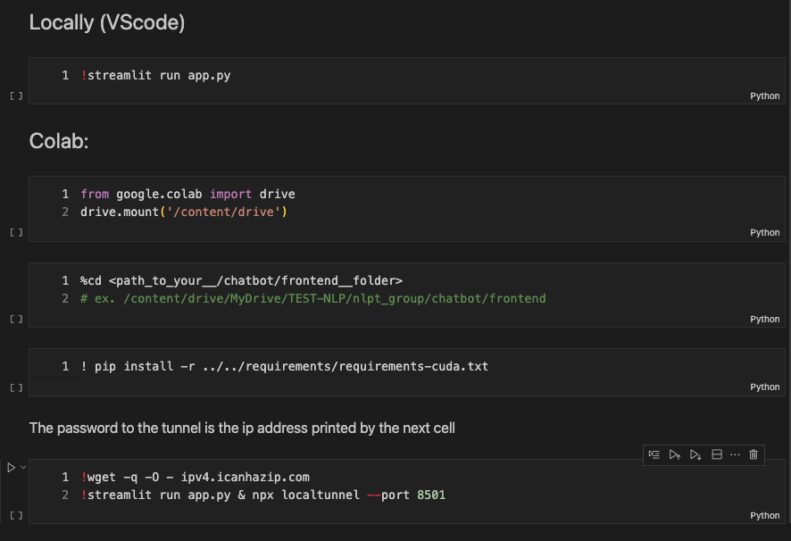
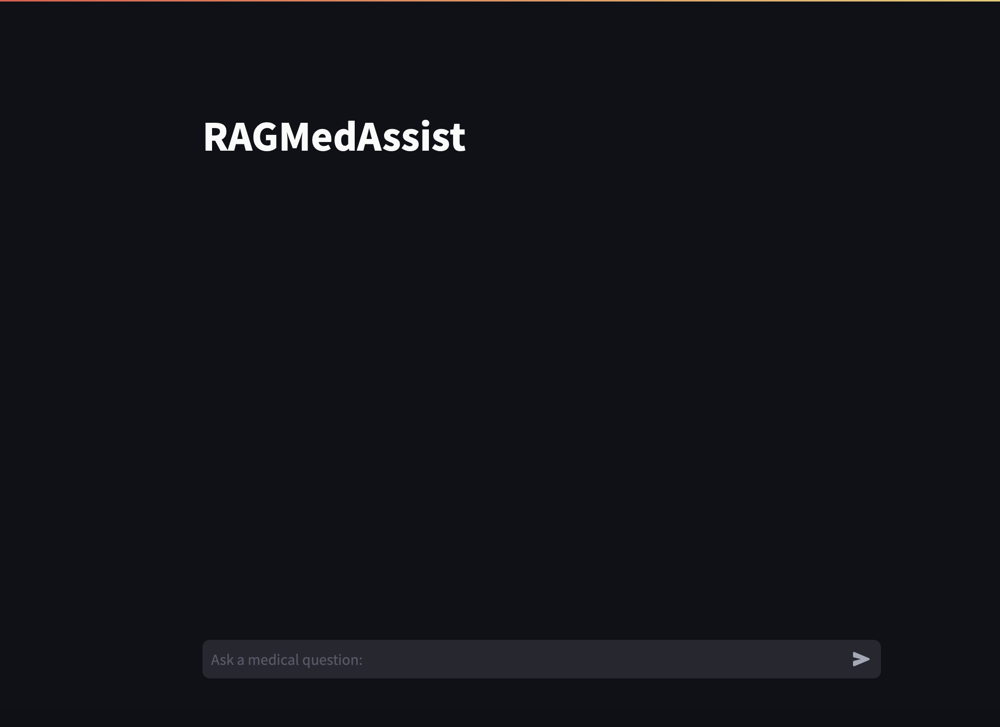

# 👾 Group Project

| Name and surname    |  Matric. Nr. | GitHub username  |   e-mail address   |
|:--------------------|:-------------|:-----------------|:-------------------|
| Matteo Malvestiti | 4731243| Matteo-Malve | matteo.malvestiti@stud.uni-heidelberg.de|
| Sandra Friebolin | 3175035 | friebolin | sandra_friebolin@proton.me |
| Yusuf Berber | 4736316 | yberber | yusuf.berber@stud.uni-heidelberg.de |

### Advisor
Robin Khanna (R.Khanna@stud.uni-heidelberg.de)

# 🔀 Cloning the Git Repository
It's a prerequisite to have a working installation of [Git Large File Storage](https://git-lfs.com) (LFS). Embeddings and chunked text are for example syncronized via LFS. Follow the appropriate installation procedure for your machine. Afterwards cloning proceeds in the standard way. 

 **If you don't do this you will have cloned a repo with missing pieces and the code will not work.**

#  ⚠️ DISCLAIMER 

Building a portable app was not the goal of the lecture, therefore we devoted all our efforts to NLP features. 

We all had M1/M2 MacBooks, therefore we can **guarantee a smooth execution only on this setup**. 

ℹ️ In more detail: We all ran and tested on a Miniconda environment for ARM machines. To reproduce the same exact environment you can build on top of this [configuration file](https://github.com/jeffheaton/app_deep_learning/blob/main/install/torch.yml). However it should be sufficient to install all the required modules in your environment via the procedure described in the following section.

☝🏽 Please follow the instructions carefully, especially regarding GPT4ALL.

To provide a more universal chance to run our chatbot, we also made sure that the app and other features (like the prompt engineering analysis) run smoothly on Colab. But it's important that the whole repository gets cloned in Colab, since every script has some dependencies. Moreover Colab is substantially slower in the setup.

⚡️ We were unable to conduct tests of the app on the remote Computational Linguistics university server, which one team member utilized for GPU access, due to limitations in setting up port forwarding from the remote to the local server.

Despite all said, we expect a correct behavior on Windows/Linux machines, but we could not perform any test on this setup.

# 🛠️ Installing missing modules

All required packages are inside requirements' files. \
First of all, move inside the requirements folder: `cd requirements`. Then:

➡️ `pip install -r requirements-mps.txt` (see [`requirements-mps.txt`](./requirements/requirements-mps.txt)) if you run on M1/M2 Macs.

➡️ `pip install -r requirements-cuda.txt` (see [`requirements-cuda.txt`](./requirements/requirements-cuda.txt)) on Colab or machines that support CUDA. 

For Colab's users, a code cell has already been provided in the Colab's section of the [app launcher](./chatbot/frontend/app_launcher.ipynb) notebook.

# 🛠️ Downloading the LLM

- Mac users
  - Download the [GPT4ALL](https://gpt4all.io/index.html) app
  - Download _Mistral Instruct_ inside the very user-friendly app
  - Specify the path to the local installation inside the configuration file [`cfg.yaml`](./chatbot/app/cfg.yaml)
  - Ready to go, and very very fast 🐇

- Colab 
  - Do nothing and it will be automatically downloaded from [Huggingface's Hub](https://huggingface.co/mistralai/Mistral-7B-v0.1/discussions/104)
  - Ready to go, but when you launch the app it will take some time to download the model 🐌

- Windows and Ubuntu
  - You can theoretically use [GPT4ALL](https://gpt4all.io/index.html) as with Mac, but it was not tested.

- General machine with CUDA:
  - Running the frontend app could not be tested, but executing our main code [`custom_chatbot.py`](chatbot/app/custom_chatbot.py) works fine!
  

# 🚀 Launch the Chatbot App

**RECOMMENDED:** Open the jupyter notebook [app_launcher.ipynb](./chatbot/frontend/app_launcher.ipynb) inside the folder `./chatbot/frontend/`. It will look like this:

  

- On Mac:
  - Just execute the first cell, containing `!streamlit run app.py`
  - A new tab in your default browser should authomatically open on the local server and you will be ready to go.
  - If this doesn't happen, copy and paste the outputed url in your browser. It should be `http://localhost:8501`. If you don't run on local as specified in DISCLAIMER, you will encounter issues in this step.

- On Colab: a little less friendly option, but we tried to make the user experience as easy as possible! 
  - With the provided cells, mount your google drive and move to the correct folder
  - Run the dedicated cell to install all the required modules.
  - Run the launch command provided in the last cell:

        !wget -q -O - ipv4.icanhazip.com
        !streamlit run app.py & npx localtunnel --port 8501

  - ℹ️ As Colab is a closed environment, a localtunnel is required.
  - Click on the provided url.
  - A gate webpage will block you before actually getting to the app. Copy and paste the IP address printed by the cell, paste it in the password-box and cofirm.

  ⚠️ REMINDER: The setup on Colab is very slow, because it needs to download the LLM every time the app is launched. It might be rough, but we tested it and it works correctly.

- Windows, Ubuntu and general local machines with CUDA:
  - Follow the same procedure for Mac (But we could not test it)

➡️ This is how the app will look like!

  

