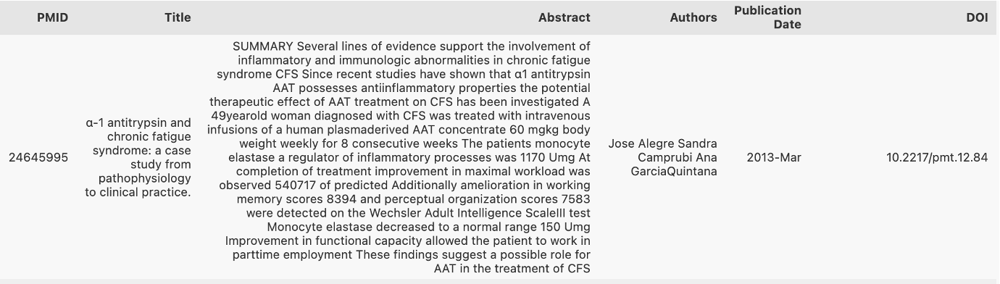

# [TITLE]
### Team members:
| Name and surname    |  Matric. Nr. | Course of study                            |   e-mail address   |
|:--------------------|:-------------|:-------------------------------------------|:-------------------|
| Matteo Malvestiti | 4731243| M.Sc. Data and Computer science (Erasmus) | matteo.malvestiti@stud.uni-heidelberg.de|
| Sandra Friebolin | 3175035 | M.Sc. Computational linguistics (?) | sandra_friebolin@proton.me |
| Yusuf Berber | ...... | M.Sc. Data and Computer Science (?) | yusuf.berber@stud.uni-heidelberg.de |

### Member contributions
Please refer to Asana, the task manager we used over the course of all the project. All the tasks are unpacked and are labeled with whom was in charge to complete them. The access was granted to our supervisor during the project. \
We will like to specify that the group had a good chemistry and we all worked together to the final goal, helping each other out and coordinating efficiently when some tasks were dependent on others.

### Advisor
Robin Khanna (R.Khanna@stud.uni-heidelberg.de)

### Anti-plagiarism Confirmation
.....

***
# 1. Introduction
Navigating the complexities of medical information, especially when it is laden with technical jargon, can be overwhelming yet essential for making critical health decisions. Our system bridges this gap by simplifying the intricate world of medical knowledge. It allows users to ask questions in everyday language and provides informed, understandable answers derived from a comprehensive medical dataset.

By also citing sources, our system not only educates but empowers users to verify and trust the information, facilitating more informed health decisions. The target audience for our project is [...]

Our focus is on leveraging generative AI with Retrieval Augmented Generation (RAG) techniques to efficiently navigate through 60,000 PubMed article abstracts on intelligence. This approach overcomes the limitations of traditional keyword searches by using a hybrid search algorithm. It combines semantic retrieval, using dense vector search for relevance based on cosine similarity, with keyword search for domain-specific terms. Our innovative use of Pinecone's hybrid search integrates a sparse-dense index, optimizing accuracy and preventing misinformation. 

- outline of our approach 
- outlook on results

<!-- maybe it is best written at the end, since we don't know exactly what our results will be/which exact problem (students/professionals..) we address :D 

I would not put the following in the introduction. I think it should only briefly outline our approach without technical details :) 

"""as it will be better explained in sec.3 [Approach]. The code is entirely written in python and we make use of the incredible langchain lybrary.
Before arriving at this point though, a huge amoutn of work was spent on the retrieval of the dataset, on the search of a good database and on the choice of the embedding model. The latter was supported by a big evaluation process, distinguished in two phases: quantitative and qualitative. More detailes are recorded in section 3 and in the README of the evaluation folder.
[...]"""
-->

# 2. Related Work
- put our work into context of current research
- including papers read for research/that used same techniques but applied to different problems
- emphasize how our work differs from previous work, outlining their limitations/why our application domain is different
- ⚠️ only major points, not too much detail

# 3. Approach
- conceptual details of our system (about its functionality, its components, data processing pipelines, algorithms, key methods)
- 💡 be specific about methods (include equations, show figures...)
- 💡 emphasize creative/novel parts, but also properly cite existing methods
- 💡 stick to fixed vocabulary (mathematical notations, method & dataset names) and writing style!
- describe baseline approaches (briefly if from external source)

## 3.1 Data Processing Pipelines

### 3.1.1 Data Pre-Processing
Several data cleaning and pre-processing strategies were considered and applied according to their usefulness to our specific application:

❌ **Lowercasing:** Converting all text to lowercase can be beneficial for consistency and improve performance for many embedding models. However, in certain scientific contexts, such as our biomedical texts, case sensitivity is important, for instance when distinguishing between gene names and common words. We thus decided against lowercasing, also given that we used very advanced embedding models able to handle case sensitivity.

❌ **Handling Stop Words:** Removing common words that do not contribute much meaning to the sentences was a common practice for traditional approaches as it gives more focus on important content words. However, advanced embedding models, especially those based on Transformer architecture, are designed to understand and generate natural language capturing the context of the entire sentence or document, including the function of stop words [add citation]. We thus decided against removing them.

❌ **Handling Bigrams or N-grams:** Advanced Transformer based models do not require this step since they are designed to capture word context using their attention mechanisms and positional embeddings, making explicit n-gram creation less necessary.

✅ **Removing Special Characters:** This includes stripping out unnecessary punctuation, symbols, or special characters that are not relevant to the analysis or could interfere with the model's understanding of the text. We apply this step to to enhance data consistency and reduce noise, thereby improving model focus and efficiency.

✅ **Normalization:** This process standardizes text to a consistent format, enhancing data uniformity and simplifying processing. Specifically, we implemented Unicode normalization to transform author names with special characters — common in languages such as Swedish and French — into a uniform representation. 

✅ **Tokenization:** Essential to the embedding process, tokenization divides text into manageable pieces, or tokens. Our chosen embedding models employ unique tokenizers that segment text into words and subwords. This granularity enables precise interpretation of biomedical terminology, accommodating the field's extensive vocabulary and specialized jargon.

✅ **Removing Short Abstracts:** Abstracts with fewer than 100 characters often lack sufficient detail, offering minimal insight. To enhance our dataset's quality, we excluded such brief abstracts and those lacking any abstract text. This refinement process resulted in the retention of 58,535 abstracts, effectively removing 319 from our initial collection.

## 3.2 Algorithms/Methods

## 3.3 Baselines

# 4. Experimental Setup and Results

## 4.1 Data
- describe the data
- outline where, when, and how it was gathered 
- show insightful metrics
    - length (max, min, average)
    - distribution of publications (frequency per year to understand how interest in the topic "intelligence" has grown over time)
    - most common authors
    - make a topic analysis to see the most common topics (from titles? and abstracts?)
    - readability/accessibility scores (e.g., Flesch-Kincaid) on abstracts to assess how accessible the information is to general audiences, crucial for RAG

The dataset comprises abstracts and associated metadata from medical articles sourced from [PubMed](https://pubmed.ncbi.nlm.nih.gov/?term=intelligence+%5BTitle%2Fabstract%5D&filter=simsearch1.fha&filter=years.2013-2023&sort=date), a free search engine for life sciences and biomedical literature, managed by the U.S. National Library of Medicine at the National Institutes of Health. To manage time and computational constraints, our focus is limited to abstracts published between 2013 and 2023 featuring the keyword "intelligence", totaling 58,854 documents.

The documents in the dataset follow a structured format typical of biomedical literature. Each document contains several key elements that have designated abbreviations:

- **PMID (PubMed Identifier):** A unique number assigned to each PubMed record, used for easy reference and retrieval.
- **Title (TI):** The title of the article.
- **Abstract (AB):** A brief summary of the research, methods, results, and conclusions. It's a crucial part of the document as it provides the essence of the research without the need to read the full article.
- **Authors (FAU and AU):** Lists the full names (FAU) and initials (AU) of the authors, along with their affiliations (AD), providing information about who conducted the research and their institutional backgrounds.
- **Date of Publication (DP):** Indicates when the article was published, which is important for understanding the timeliness and relevance of the research.
- **DOI (Digital Object Identifier - LID):** A unique alphanumeric string assigned to the document, providing a permanent link to its location on the internet.
- **Additional Information:** Includes various bibliographic details like journal name (JT), issue (IP), volume (VI), language of the article (LA), grant and funding information (GR), and publication type (PT). However, we do not plan to use these as metadata for our application.

The metadata selected for our project encompasses the authors, title, date, and DOI of each document, as illustrated in this data point example:

This information not only aids in establishing the credibility and context of the research but also enables our system to link directly to the source in the answers it generates - an additional functionality of our system. The abstracts, serving as the core of our dataset, will be utilized by our retrieval system to identify and present the most pertinent document in response to user queries, thereby forming the basis for generating informed and accurate answers.

## 4.2 Evaluation Method
- explain & define used/own metrics 
- motivate expected achievements

### 4.2.1 Evaluation of Information Retrieval 
#### I. Quantitative Evaluation 
#### II. Qualitative Evaluation
### 4.2.2 Evaluation of Chatmodel

## 4.3 Experimental Details
- explain configurable parameters of our methods
- explain specific usage 

## 4.4 Results
- compare own results to baseline
    - use basic chatmodel as baseline (maybe the one used in one of the assignments) and compare it with our choice
    - idea: 10 questions give to ChatGPT and our system: does RAG improve performance/prevent hallucinations
- present plots/tables of the before explained evaluation

## 4.5 Analysis
- present qualitative analysis
- does our system work as expected?
- cases in which system consistently succeeds/fails? 
- does baseline succeeds/fails in same cases?
- use examples & metrics to underline our points instead of stating unproven points

# 5. Conclusion and Future Work
- recap briefly main contributions
- highlight achievements
- reflect limitations
- outline possible extensions of our system or improvements for the future
- briefly give insights what was learned during this project

***
# References

