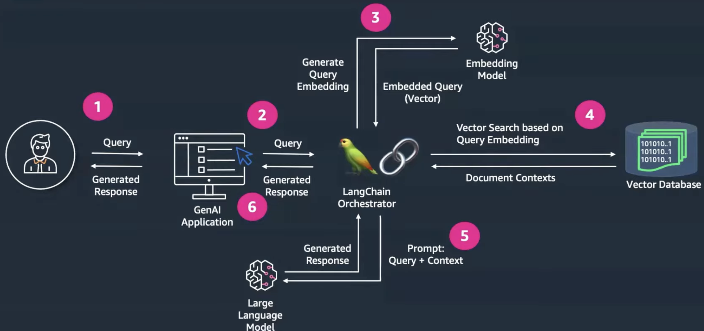

Recurrent ONLINE Meetings: every Wednesday at 17.00

Next Meeting scheduled: Monday after class

## To do before next meeting:
- Read and try to figure out which Dataset is better. Use this file to annotate pros and cons.
- Read and try to understand functionalities and possible advantages of Langchain
- Set up Confluence?

## Milestone Meeting
-  We should have acquired the data necessary and set up a search system to find
relevant documents for a given question or, more generally, query.
- Prepare questions.

## Comments on datasets

### 1. [Medical Dataset](https://pubmed.ncbi.nlm.nih.gov/?term=intelligence+%5BTitle/abstract%5D&filter=simsearch1.fha&filter=years.2014-2024&sort=date)

- PubMed: abstracts of the articles published between the years 2013 to 2023 that
contain the word “intelligence” in the abstract’s text
- 58,063 small documents

👍🏽 Possible Advantages
- Abstracts are structured (Background, Aim, Methods, Conclusion, Keywords, ...)
- Easy to understand abstracts
- Relatively short: most important info compressed/summarized (-> questions can't go into too much detail? Use several documents for one answer?)
- Might be more useful to give abstractive answers (e.g. a doctor interested in ensemble of previous cases, then checking the reports?)

👎🏽 Possible Disadvantages
- "Intelligence" key word must be present: encompasses diverse papers from various categories (e.g. artificial intelligence, behavioral issues, medical conditions...)
- Word count of the medical data might be significantly higher than that of the legal data?

### 2. [Legal Dataset](https://eur-lex.europa.eu/search.html?name=browse-by:legislation-in-force&type=named&displayProfile=allRelAllConsDocProfile&qid=1696858573178&CC_1_CODED=12)

- EUR-Lex: English articles present in different file formats for the “energy” domain
- 524 very long documents

👍🏽 Possible Advantages
- Extractive answer might be enough (e.g. question like: "Find me the law that said ..." and it retrieves law(s), citing them)
- Most legal documents contain a summary and generally more metadata/keywords than medical data

👎🏽 Possible Disadvantages
- Extremely long files (20-30 pages): we would need to find a way to truncate/only use certain sections
- Hard to understand
- To make use of the summary/keywords, we need more detailed data preprocessing (documents should be broken down into smaller parts before storing them in Elasticsearch or OpenSearch, which adds extra work)

### Possible Conclusion
Medical data is easier to meet the project's expectations in spite of larger data to deal with, while the legal data offers opportunities to demonstrate our knowledge but it might bring multiple trial-and-error processes with itself and might take relatively more time.

## 💿 First Steps: Data Preparation 💿

- Data Collection
    - Determine relevant metadata
- Data Storage
    - Choose appropriate databases for data (e.g. OpenSearch to store the actual text of the abstracts)
    - and for vectors (e.g. [Pinecone](https://www.pinecone.io/), optimized for similarity search)
    - Linking data and embeddings: via some unique identifier (UID) for each abstract consistent in both systems (in OS, include the UID as a field in each document as primary key for each abstract, when storing the embeddings in Pinecone, use the same UID as the key for each embedding)
- Document Search
    - Possible framework: LangChain
        - Open-source framework to simplify development of applications that use LLMs
        - Wrappers for implementations of the standard components of LLM-based applications (vector stores, embedding models, ...)
        - Provides functionality to simplify result chaining and memory, reducing code complexity for building advanced GenAI pipelines
        

    - Which embedding model?
        - Embedding Model: Fine-tuned BERT models (e.g. [BioBERT Paper](https://arxiv.org/abs/1901.08746): used data from PubMed = specifically trained on biomedical literature, making it suitable, amounting to 4.5 billion words, but 4-5 years old)
    - Similarity Measure: Cosine similarity
    - Search Algorithm: Top-n, nucleus sampling

## System Integration for RAG (Retrieval Augmented Generation)
💡 [Helpful tutorial from LangChain website for RAG](https://python.langchain.com/docs/use_cases/question_answering/)

Source: [Youtube tutorial for RAG using LangChain](https://www.youtube.com/watch?v=J_tCD_J6w3s)

### Query Processing and Retrieval
- User Query: The user inputs a query (a question or a topic they need information about)
- Query Embedding: Use BioBERT to convert this query into an embedding.
- Retrieval from Pinecone: Use the query embedding to retrieve the most relevant document embeddings from Pinecone, which returns a list of UIDs.
- Fetching from OpenSearch: Use the UIDs obtained from Pinecone to retrieve the corresponding abstracts from OpenSearch.

### Answer Generation
- Input to GPT-3.5: Feed the retrieved abstracts (or relevant excerpts) into GPT-3.5 along with the user query.
- Generate Answer: GPT-3.5 generates an answer based on the content of the abstracts and the context provided by the query.
- Error Handling: Implement robust error handling for cases where an abstract might not be found or the model fails to generate a relevant answer.

