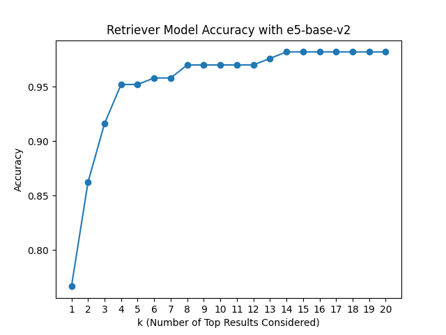

# Accuracy

The following are the accuracy scores for different values of top k considered results. The top three performing models for k=3 are *thenlper_gte-base*, *BAAI_bge-base-en-v1.5* and *jamesgpt1_sf_model_e5*.

|                                  |   k=1 |   k=2 |   k=3 |   k=4 |   k=5 |   k=6 |   k=7 |   k=8 |   k=9 |   k=10 |   k=11 |   k=12 |   k=13 |   k=14 |   k=15 |   k=16 |   k=17 |   k=18 |   k=19 |   k=20 |
|:---------------------------------|------:|------:|------:|------:|------:|------:|------:|------:|------:|-------:|-------:|-------:|-------:|-------:|-------:|-------:|-------:|-------:|-------:|-------:|
| dmis-lab_biobert-base-cased-v1.1 | 0.084 | 0.114 | 0.168 | 0.192 | 0.198 | 0.204 | 0.216 | 0.24  | 0.251 |  0.257 |  0.275 |  0.287 |  0.287 |  0.287 |  0.293 |  0.299 |  0.299 |  0.299 |  0.317 |  0.323 |
| all-MiniLM-L6-v2                 | 0.683 | 0.838 | 0.856 | 0.88  | 0.898 | 0.928 | 0.934 | 0.94  | 0.94  |  0.946 |  0.952 |  0.958 |  0.964 |  0.964 |  0.97  |  0.976 |  0.976 |  0.976 |  0.976 |  0.976 |
| **BAAI_bge-base-en-v1.5**            | 0.85  | 0.94  | **0.964** | 0.976 | 0.982 | 0.982 | 0.982 | 0.982 | 0.982 |  0.982 |  0.982 |  0.982 |  0.982 |  0.988 |  0.988 |  0.988 |  0.988 |  0.988 |  0.988 |  0.988 |
| llmrails_ember-v1                | 0.85  | 0.934 | 0.958 | 0.964 | 0.97  | 0.976 | 0.982 | 0.982 | 0.982 |  0.982 |  0.982 |  0.982 |  0.982 |  0.982 |  0.982 |  0.982 |  0.982 |  0.982 |  0.982 |  0.982 |
| **jamesgpt1_sf_model_e5**            | 0.856 | 0.922 | **0.964** | 0.97  | 0.97  | 0.982 | 0.982 | 0.982 | 0.982 |  0.982 |  0.982 |  0.982 |  0.982 |  0.982 |  0.982 |  0.982 |  0.982 |  0.982 |  0.982 |  0.982 |
| **thenlper_gte-base**                | 0.91  | 0.946 | **0.976** | 0.976 | 0.982 | 0.994 | 0.994 | 0.994 | 0.994 |  0.994 |  0.994 |  0.994 |  0.994 |  0.994 |  0.994 |  0.994 |  0.994 |  0.994 |  0.994 |  0.994 |
| intfloat_e5-base-v2              | 0.79  | 0.904 | 0.94  | 0.958 | 0.958 | 0.964 | 0.964 | 0.97  | 0.97  |  0.97  |  0.97  |  0.976 |  0.982 |  0.982 |  0.982 |  0.982 |  0.982 |  0.982 |  0.982 |  0.988 |

The plots are arranged in descending order based on the performance of the models, displaying the 3 best-performing models first.

  
   
  

  
   
  
   
  

# F1

# MRR

# nDCG