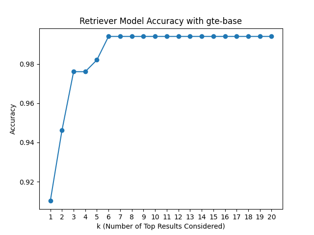
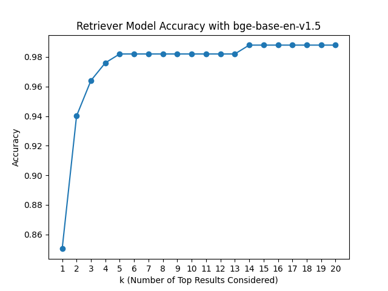

# 📈 1. Quantitative Evaluation

## Accuracy

The following are the accuracy scores for different values of top k considered results. The top three performing models for k=3 are *thenlper_gte-base*, *BAAI_bge-base-en-v1.5* and *jamesgpt1_sf_model_e5*.

|                                  |   k=1 |   k=2 |   k=3 |   k=4 |   k=5 |   k=6 |   k=7 |   k=8 |   k=9 |   k=10 |   k=11 |   k=12 |   k=13 |   k=14 |   k=15 |   k=16 |   k=17 |   k=18 |   k=19 |   k=20 |
|:---------------------------------|------:|------:|------:|------:|------:|------:|------:|------:|------:|-------:|-------:|-------:|-------:|-------:|-------:|-------:|-------:|-------:|-------:|-------:|
| dmis-lab_biobert-base-cased-v1.1 | 0.084 | 0.114 | 0.168 | 0.192 | 0.198 | 0.204 | 0.216 | 0.24  | 0.251 |  0.257 |  0.275 |  0.287 |  0.287 |  0.287 |  0.293 |  0.299 |  0.299 |  0.299 |  0.317 |  0.323 |
| all-MiniLM-L6-v2                 | 0.683 | 0.838 | 0.856 | 0.88  | 0.898 | 0.928 | 0.934 | 0.94  | 0.94  |  0.946 |  0.952 |  0.958 |  0.964 |  0.964 |  0.97  |  0.976 |  0.976 |  0.976 |  0.976 |  0.976 |
| **BAAI_bge-base-en-v1.5**            | 0.85  | 0.94  | **0.964** | 0.976 | 0.982 | 0.982 | 0.982 | 0.982 | 0.982 |  0.982 |  0.982 |  0.982 |  0.982 |  0.988 |  0.988 |  0.988 |  0.988 |  0.988 |  0.988 |  0.988 |
| llmrails_ember-v1                | 0.85  | 0.934 | 0.958 | 0.964 | 0.97  | 0.976 | 0.982 | 0.982 | 0.982 |  0.982 |  0.982 |  0.982 |  0.982 |  0.982 |  0.982 |  0.982 |  0.982 |  0.982 |  0.982 |  0.982 |
| **jamesgpt1_sf_model_e5**            | 0.856 | 0.922 | **0.964** | 0.97  | 0.97  | 0.982 | 0.982 | 0.982 | 0.982 |  0.982 |  0.982 |  0.982 |  0.982 |  0.982 |  0.982 |  0.982 |  0.982 |  0.982 |  0.982 |  0.982 |
| **thenlper_gte-base**                | 0.91  | 0.946 | **0.976** | 0.976 | 0.982 | 0.994 | 0.994 | 0.994 | 0.994 |  0.994 |  0.994 |  0.994 |  0.994 |  0.994 |  0.994 |  0.994 |  0.994 |  0.994 |  0.994 |  0.994 |
| intfloat_e5-base-v2              | 0.79  | 0.904 | 0.94  | 0.958 | 0.958 | 0.964 | 0.964 | 0.97  | 0.97  |  0.97  |  0.97  |  0.976 |  0.982 |  0.982 |  0.982 |  0.982 |  0.982 |  0.982 |  0.982 |  0.988 |

The plots are arranged in descending order based on the performance of the models, displaying the 3 best-performing models first.

  
   
  

  
   
  
   
  

## F1

We decided to only further evaluate the 5 top performing models. (results for the other 3 are in the making) F1 score is a harmonic mean of precision and recall, and it ranges from 0 to 1, where 1 is the best possible score, indicating perfect precision and recall, and 0 is the worst.

|                       |   k=1 |   k=2 |   k=3 |   k=4 |   k=5 |   k=6 |   k=7 |   k=8 |   k=9 |   k=10 |
|:----------------------|------:|------:|------:|------:|------:|------:|------:|------:|------:|-------:|
| BAAI_bge-base-en-v1.5 | 0.85  | 0.643 | 0.5   | 0.4   | 0.333 | 0.286 | 0.25  | 0.222 | 0.2   |  0.182 |
| **llmrails_ember-v1**     | 0.85  | 0.639 | **0.503** | 0.402 | 0.335 | 0.287 | 0.251 | 0.224 | 0.201 |  0.183 |
| **jamesgpt1_sf_model_e5** | 0.856 | 0.635 | **0.506** | 0.407 | 0.339 | 0.294 | 0.257 | 0.229 | 0.206 |  0.187 |
| **thenlper_gte-base**     | 0.91  | 0.651 | **0.512** | 0.41  | 0.345 | 0.299 | 0.262 | 0.233 | 0.21  |  0.191 |
| intfloat_e5-base-v2   | 0.79  | 0.619 | 0.485 | 0.388 | 0.323 | 0.277 | 0.243 | 0.216 | 0.194 |  0.176 |

💡 F1 score interpretation: the system's ability to balance relevance (precision) with completeness (recall) diminishes as more results are considered, a common characteristic of retrieval systems, highlighting the importance of focusing on the quality of the top-ranked documents.

The plots are again arranged in descending order based on the performance of the models, displaying the 3 best-performing models first.

  
  
   

  

  
   

## MRR

For MRR, the consideration of varying k is not applicable because the metric is singularly focused on how well a system ranks the first piece of relevant information. Whether that relevant item appears at rank 1, 2, or any other position, MRR captures this by averaging the reciprocal ranks of the first relevant item across all queries.

|                       |     |
|:----------------------|------:|
| **BAAI_bge-base-en-v1.5** | **0.906** |
| llmrails_ember-v1     | 0.9   |
| **jamesgpt1_sf_model_e5** | **0.905** |
| **thenlper_gte-base**   | **0.938** |
| intfloat_e5-base-v2   | 0.864 |

💡 MRR interpretation: on average, the first relevant or correct answer tends to be very close to the top position in the search results

## nDCG

Our nDCG evaluation was limited to k=1,2,3 to mirror the operational constraints of our later system, which only processes the top three documents. It provides insight into how well our retrieval system ranks relevant documents at the top of its search results.

|                       |   k=1 |   k=2 |   k=3 |
|:----------------------|------:|------:|------:|
| BAAI_bge-base-en-v1.5 | 0.536 | 0.593 | 0.609 |
| **llmrails_ember-v1**     | 0.536 | 0.59  | **0.611** |
| **jamesgpt1_sf_model_e5**     | 0.54 | 0.588  | **0.614** |
| **thenlper_gte-base**     | 0.574 | 0.607  | **0.628** |
| intfloat_e5-base-v2      | 0.499 | 0.567  | 0.586 |

💡 nDCG interpretation: gradual increase in nDCG scores from k=1 to k=3 illustrates that while the very first document might not always be the most relevant, the system generally ranks highly relevant documents within the top 3 positions

***

# 🧐 2. Qualitative Evalution