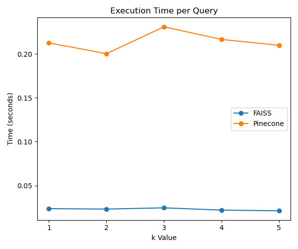
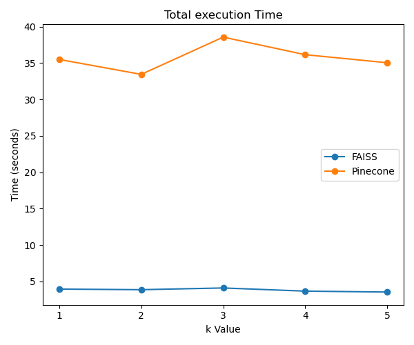
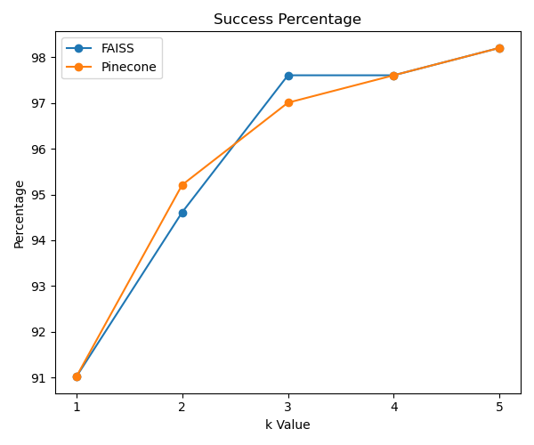

# Vectorstore Retrievers Evaluation

This document presents the evaluation results of two vectorstore retrievers: Faiss and Pinecone, over a range of top `k` values with the search type similarity.

## Evaluation Results

The evaluation was conducted over a set of 167 queries, comparing the performance based on the following metrics:
- Execution time per query
- Total execution time
- Match count
- Success percentage

###  Results for FAISS

| Metric | Execution Time per Query | Total Execution Time | Match Count | Success Percentage |
|--------|--------|-------|--------|-------|
| k=1 | 0.0236 seconds | 3.9481 | 152 | 91.02% |
| k=2 | 0.0231 seconds | 3.8656 | 158 | 94.61% |
| k=3 | 0.0246 seconds | 4.1032 | 163 | 97.60% |
| k=4 | 0.0220 seconds | 3.6683 | 163 | 97.60% |
| k=5 | 0.0212 seconds | 3.5427 | 164 | 98.20% |

###  Results for Pinecone

| Metric | Execution Time per Query | Total Execution Time | Match Count | Success Percentage |
|--------|--------|-------|--------|-------|
| k=1 | 0.2125 seconds | 35.4944 | 152 | 91.02% |
| k=2 | 0.2003 seconds | 33.4454 | 159 | 95.21% |
| k=3 | 0.2309 seconds | 38.5603 | 162 | 97.01% |
| k=4 | 0.2165 seconds | 36.1497 | 163 | 97.60% |
| k=5 | 0.2098 seconds | 35.0408 | 164 | 98.20% |

## Performance Comparison

The performance comparison between FAISS and Pinecone retrievers is visualized in the following sections.
### Execution Time per Query

### Total Execution Time

### Success Percentage

